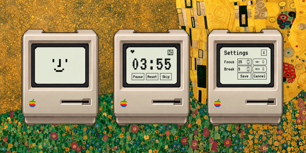

# Pomintosh

A tiny Pomodoro desktop widget for macOS, inspired by the 1984 Macintosh. Drag the mini Mac anywhere on your desktop and use its screen to focus, take a break, or adjust your timer. Runs offline as a standalone app.



- Focus: 25 minutes. Break: 5 minutes.
- Start, pause, reset, skip, and custom durations.
- Startup beep, completion chime, and a heart counter for finished focus sessions.
- macOS: tested on 27.0 with Apple Silicon. Older versions and Intel Macs are unverified.

## Requirements

- Node.js 22.12+
- Rust
- [Tauri prerequisites](https://v2.tauri.app/start/prerequisites/)

## Run

```sh
npm install
npm run tauri dev
```

Browser demo: `npm run dev`.

## Install

Build: `npm run tauri -- build`. The `.app` and `.dmg` are in `src-tauri/target/release/bundle/`.

Open the DMG and drag Pomintosh into Applications. This build is for Apple Silicon on macOS 13+. It is not notarized; macOS may require **System Settings → Privacy & Security → Open Anyway** on first launch. [Signing details](https://v2.tauri.app/distribute/sign/macos/).
